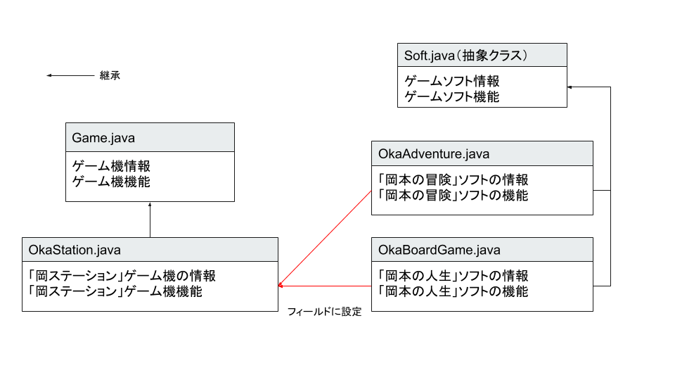

# JavaOOP 抽象クラス

## 追加問題

ゲーム機とゲームソフトをオブジェクト指向で表現します。



今回はゲームソフトクラス(Soft.java)を抽象クラスに変更し、各ゲームソフトは抽象クラスであるゲームソフトクラスを継承するように変更します。
また、新たなゲームソフト「岡本の人生」を作成します。

### 問題１

`ゲームソフトクラス(Soft.java)`を抽象クラスに変更します。
さらに、ゲーム起動時の初期機能である抽象メソッド`gameStart`メソッドを追加します。
前回作成したクラスを抽象クラスに変更し、メソッドを追加してください。

#### ゲームソフトクラス(Soft.java)

- フィールド

  | フィールド名 | 型   | 説明  |
  | --- | --- | --- |
  | name | 文字列 | ゲームソフト名   |
  | size | 整数   | ゲームソフト容量 |

- コンストラクタ

  | 引数                             | 説明                                                             |
  | --- | --- |
  | ゲームソフト名、ゲームソフト容量 | フィールドのゲームソフト名とゲームソフト容量に引数の値を設置する |

- メソッド

  | メソッド名 | 引数 | 戻り値 | 説明  |
  | --- | --- | --- | --- |
  | loadSoft | なし | なし   | ・`*----ゲームソフトを読み込みました。----*`<br>`ゲームソフト名："ゲームソフト名"`<br>`ソフト容量："ゲームソフト容量" GB`<br>を画面に表示する。<br>・ゲーム名とソフト名はフィールドの値を表示すること。 |
  | gameStart  | なし | なし   | 抽象メソッド。ゲーム開始時の初期機能を実装する。実装は継承する各クラスで行う。                                                                |

### 問題２

ゲームソフトクラスを継承するゲームソフト`岡本の冒険(OkaAdventure.java)`を作成します。
また、コンストラクターを変更し、登場キャラクター名をゲームの初期起動時に設定できるように変更します。標準入力を仕様するので、補足を確認してください。
前回作成したクラスを流用します。`???`の部分はご自身で考えて設計してください。

#### 岡本の冒険クラス(OkaAdventure.java)

- フィールド

  | フィールド名   | 型     | 説明               |
  | --- | --- | --- |
  | characterName | 文字列 | 登場キャラクター名 |

- コンストラクタ

  | 引数                             | 説明                                                                             |
  | --- | --- |
  | ゲームソフト名、ゲームソフト容量 | ・継承元のコンストラクタを呼び出し、ゲームソフト名、ゲームソフト容量を設定する。 |

- メソッド

  | メソッド名 | 引数 | 戻り値 | 説明  |
  | --- | --- | --- | --- |
  | loadSoft   | なし | なし   |・ `*----ゲームソフトを読み込みました。----*`<br>`ゲームソフト名："ゲームソフト名"`<br>`ソフト容量："ゲームソフト容量" GB`<br>`キャラクター名："キャラクター名"`<br>を画面に表示する。<br>・ソフト名とソフト容量、キャラクター名はフィールドの値を表示すること。  |
  | ???        | ???  | ???    | ・`[岡本の冒険]`<br> `ゲームを始める前に、冒険者の名前を設定してください。`<br> を表示する<br>・標準入力を取得し、フィールドのキャラクター名に値を代入する。                        |

### 問題３

ゲームソフトクラスを継承するゲームソフト`岡本の人生(OkaBoardGame.java)`を作成します。
ステージ名とプレーヤー人数をゲームの初期起動時に設定できるように変更します。標準入力を使用するので、補足を確認してください。
`???`の部分はご自身で考えて設計してください。

### 岡本の人生(OkaBoardGame.java)

ゲームソフトクラスを継承すること。

- フィールド

  | フィールド名 | 型     | 説明           |
  | --- | --- | --- |
  | stage        | 文字列 | ステージ名     |
  | playNumber   | 整数   | プレイヤー人数 |

- コンストラクタ

  | 引数   | 説明  |
  | --- | --- |
  | ゲームソフト名、ゲームソフト容量 | ・継承元のコンストラクタを呼び出し、ゲームソフト名、ゲームソフト容量を設定する。 |

- メソッド

  | メソッド名 | 引数 | 戻り値 | 説明  |
  | --- | --- | --- | --- |
  | ??? | ???  | ???    | ・`[岡本の人生]`<br> `岡本の人生へようこそ。`<br> `ゲームを始める前に、ステージとプレイヤーの人数を設定してください。`<br> を表示する<br>・標準入力を取得し、フィールドのステージ名とプレーヤー人数に値を代入する。 |

### 問題４

`ゲーム機クラス(Game.java)`を作成します。
ゲームソフトがセットされた際に、電源がついていればゲームソフトの初期機能を実行するように`setSoftメソッド`を変更します。
前回作成したクラスを流用します。

#### ゲーム機クラス(Game.java)

- フィールド名

  | フィールド名 | 型          | 説明                             |
  | --- | --- | --- |
  | name         | 文字列      | ゲーム機名                       |
  | soft         | Soft クラス | 接続ゲームソフト                 |
  | power        | 真偽値      | 電源(`True`：電源入,`False`：電源切) |

- コンストラクタ

  | 引数       | 説明                                                                       |
  | --- | --- |
  | ゲーム機名 | フィールドのゲーム機名に引数の値を設定する。さらに電源を切った状態にする。 |

- メソッド

  | メソッド名  | 引数        | 戻り値 | 説明     |
  | --- | --- | --- | --- |
  | powerButton | なし        | なし   | ゲーム機の電源ボタン。電源がついている場合は電源を切る。電源が切れている場合は電源をつける。                                                                                     |
  | setSoft     | Soft クラス | なし   | ・ゲームソフトをセットする。フィールドの soft に、引数の値を設定する。<br>・ゲーム機の電源がついている状態であれば、ゲームソフトの情報を表示するメソッドとゲームの初期機能のメソッドを呼び出す。 |
  | showStatus  | なし        | なし   | ・`*----ゲーム機情報----*`<br> `ゲーム機名："ゲーム機名"`<br> `ソフト名："ソフト名"`<br> を表示する<br> ・電源がついていない場合は、「電源がついていません。」と表示されること。                 |

### 問題５

`ゲーム機クラス(Game.java)`を継承したゲーム機`岡ステーション(OkaStation.java)`を作成します。

### 岡ステーションクラス(OkaStation.java)

- フィールド

  | フィールド名 | 型   | 説明                 |
  | --- | --- | --- |
  | version      | 整数 | ゲーム機のバージョン |

- コンストラクタ

  | 引数                             | 説明                                                                                                                   |
  | --- | --- |
  | ゲーム機名、ゲーム機のバージョン | ・継承元のコンストラクタを呼び出し、ゲーム機名を設定する。<br>・フィールドのゲーム機のバージョンに引数の値を設定する。 |

- メソッド

  | メソッド名 | 引数 | 戻り値 | 説明                                                                                                                                                                                                                          |
  | --- | --- | --- | --- |
  | showStatus | なし | なし   | ・`*----ゲーム機情報----*`<br> `ゲーム機名：岡ステーション"バージョン"`<br>`バージョン： "バージョン"`<br> `ソフト名："ソフト名"`<br> を表示する<br>・ゲーム機名とソフト名、バージョンはフィールドの値を表示すること<br> ・電源がついていない場合は、「電源がついていません。」と表示されること。 |

### 動作確認

以下の`Main.java`ファイルを作成し、実行して正しく動作するかを確認してください。

- 動作確認クラス

	```java
	public class Main {
		public static void main(String[] args) {
			// ゲーム機を作成し電源を入れる
			Game game = new OkaStation("岡ステーション", 1);
			game.powerButton();

			// 岡本の冒険ソフトを作成し、ゲーム機に設定する
			Soft adventure = new OkaAdventure("岡本の冒険", 4);
			game.setSoft(adventure);

			// 岡本の人生ソフトを作成し、ゲーム機に設定する
			Soft boardGame = new OkaBoardGame("岡本の人生", 5);
			game.setSoft(boardGame);
		}
	}
	```

- 実行結果

  ```console
  ようこそ岡ステーションへ。

  *----ゲームソフトを読み込みました。----*
  ゲームソフト名：岡本の冒険
  ソフト容量：4 GB
  キャラクター名： null

  [岡本の冒険]
  ゲームを始める前に冒険者の名前を設定してください。
  冒険者の名前 > 岡本    ⬅️入力
  冒険者*岡本*で冒険を始めます。

  *----ゲームソフトを読み込みました。----*
  ゲームソフト名：岡本の人生
  ソフト容量：5 GB

  [岡本の人生]
  岡本の人生へようこそ。
  ゲームを始める前に、ステージとプレイヤーの人数を設定してください。
  ステージ名 > 砂漠    ⬅️入力

  プレイヤー人数 > 3    ⬅️入力
  ステージ名：砂漠
  プレイヤー人数：3人
  でゲームを始めます。
  ```

## 補足

コンソール画面からの入力(標準入力)を取得するには、`java.util`パッケージの`Scanner`クラスを使用する。
以下にサンプルコードを記載する。

```java
public class ScannerSample {
	public static void main(String[] args) {
		// 標準入力を受け取る
		java.util.Scanner scanner = new java.util.Scanner(System.in);
		System.out.print("文字を入力してください。 > ");
		String input = scanner.nextLine();
		System.out.printf("入力した文字は%sです。", input);
	}
}
```

実行結果

```bash
文字を入力してください。 > Hello World    ⬅️入力
入力した文字はHello Worldです。
```
