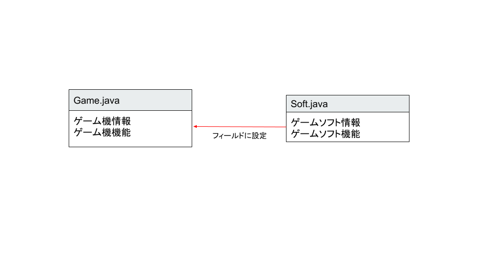

# JavaOOP クラス・オブジェクト

## 追加問題

ゲーム機とゲームソフトをオブジェクト指向で表現します。



以下の問で、ゲームソフトを表す`Soft.java`クラスと、ゲーム機を表す`Game.java`を作成していきます。

### 問題１

`ゲームソフトクラス(Soft.java)`を作成します。以下の要件を満たす`Soft.java`ファイルを作成してください。

#### ゲームソフトクラス(Soft.java)

- フィールド

  | フィールド名 | 型   | 説明  |
  | --- | --- | --- |
  | name | 文字列 | ゲームソフト名   |
  | size | 整数   | ゲームソフト容量 |

- コンストラクタ

  | 引数                             | 説明                                                             |
  | --- | --- |
  | ゲームソフト名、ゲームソフト容量 | フィールドのゲームソフト名とゲームソフト容量に引数の値を設置する |

- メソッド

  | メソッド名 | 引数 | 戻り値 | 説明  |
  | --- | --- | --- | --- |
  | loadSoft | なし | なし   | ・ゲームソフトの情報を表示するメソッド<br>・`*----ゲームソフトを読み込みました。----*`<br>`ゲームソフト名："ゲームソフト名"`<br>`ソフト容量："ゲームソフト容量" GB`<br>を画面に表示する。<br>・ゲーム名とソフト名はフィールドの値を表示すること。 |

### 問題２

`ゲーム機クラス(Game.java)`を作成します。以下の要件を満たす`Game.java`ファイルを作成してください。

#### ゲーム機クラス(Game.java)

- フィールド名

  | フィールド名 | 型          | 説明                             |
  | --- | --- | --- |
  | name | 文字列  | ゲーム機名  |
  | soft | Soft クラス | 接続ゲームソフト  |
  | power| 真偽値  | 電源(`True`：電源入,`False`：電源切) |

- コンストラクタ

  | 引数  | 説明   |
  | --- | --- |
  | ゲーム機名 | フィールドのゲーム機名に引数の値を設定する。さらに電源を切った状態にする。 |

- メソッド

  | メソッド名  | 引数        | 戻り値 | 説明                                                                                                                                                                             |
  | --- | --- | --- | --- |
  | powerButton | なし        | なし   | ゲーム機の電源ボタン。電源がついている場合は電源を切り、「ゲーム機の電源を切ります。さようなら。」を画面に表示する。電源が切れている場合は電源をつけ、「ようこそゲーム機名へ。」を画面に表示する。（ゲーム機名はフィールド値を表示すること）       |                                                                              |
  | setSoft     | Soft クラス | なし   | ・ゲームソフトをセットする。フィールドの soft に、引数の値を設定する。<br>・ゲーム機の電源がついている状態であれば、ゲームソフトの情報を表示するメソッドを呼び出す。             |
  | showStatus  | なし        | なし   | ・`*----ゲーム機情報----*`<br> `ゲーム機名："ゲーム機名"`<br> `ソフト名："ソフト名"`<br> を表示する<br>・ゲーム機名とソフト名はフィールドの値を表示すること<br> ・電源がついていない場合は、「電源がついていません。」と表示されること。 |

### 動作確認

以下の`Main.java`ファイルを作成し、実行して正しく動作するかを確認してください。

- 動作確認クラス

	```java
	public class Main {
		public static void main(String[] args) {
			Soft gameSoft = new Soft("ゲームソフト", 2);
			Game game = new Game("岡ステーション");

			// ゲームソフトをゲーム機にセットする
			game.setSoft(gameSoft);
			// ゲーム機の電源を入れる
			game.powerButton();
			// ゲームソフトをゲーム機にセットする
			game.setSoft(gameSoft);
			// ゲーム機の情報を表示する
			game.showStatus();
			// ゲーム機の電源を消す
			game.powerButton();
			// ゲーム機の情報を表示する
			game.showStatus();
		}
	}

	```

- 実行結果

  ```console
  ようこそ岡ステーションへ。

  *----ゲームソフトを読み込みました。----*
  ゲームソフト名：ゲームソフト
  ソフト容量：2 GB

  *----ゲーム機情報----*
  ゲーム機名：PS4
  ソフト名：ゲームソフト

  ゲーム機の電源を切ります。さようなら。

  電源がついていません。
  ```
