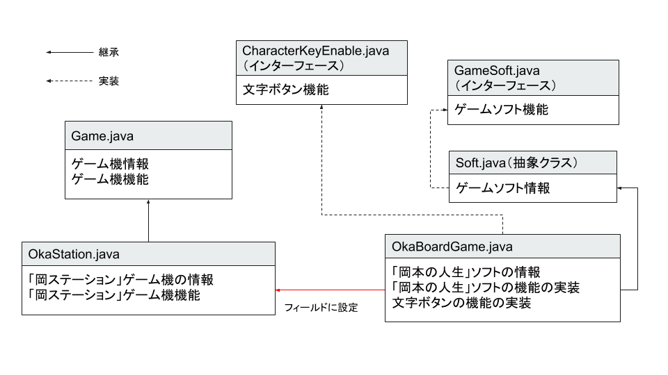

# JavaOOP インターフェース

## 追加問題

ゲーム機とゲームソフトをオブジェクト指向で表現します。



### 問題１

ゲームソフトの標準的な機能を定義する`ゲームソフトインターフェース(GameSoft.java)`と、AボタンとBボタンを押した際の機能を定義した`文字ボタンインターフェース(CharacterKeyEnable.java)`を作成します。

#### ゲームソフトインターフェース(GameSoft.java)

- メソッド

  | メソッド名 | 引数   | 戻り値 | 説明                                   |
  | --- | --- | --- | --- |
  | getGameName   | なし   | 文字列   | ゲームソフト名を返却する。         |
  | loadSoft   | なし   | なし   | ゲームソフトの情報を表示する。         |
  | gameStart  | なし   | なし   | ゲーム開始時の初期機能を実装する。     |
  | pushButton | 文字列 | なし   | 押されたボタンに応じた処理を実行する。 |

#### 文字ボタンインターフェース(CharacterKeyEnable.java)

- メソッド

  | メソッド名 | 引数 | 戻り値 | 説明                                   |
  | --- | --- | --- | --- |
  | pushA      | なし | 整数   | A ボタンが押された時の処理を実装する。 |
  | pushB      | なし | 整数   | B ボタンが押された時の処理を実装する。 |

### 問題２

抽象クラスである`ゲームクラス(Game.java)`と`ゲームソフトクラス(Soft.java)`を作成します。`ゲームソフトクラス(Soft.java)`は、`ゲームソフトインターフェース(GameSoft.java)`を実装します。
前回作成したクラスを流用します。

#### ゲーム機クラス(Game.java)

抽象クラスです。

- フィールド名

  | フィールド名 | 型          | 説明                             |
  | --- | --- | --- |
  | name         | 文字列      | ゲーム機名                       |
  | soft         | GameSoftインターフェース | 接続ゲームソフト                 |
  | power        | 真偽値      | 電源(`True`：電源入,`False`：電源切) |

- コンストラクタ

  | 引数       | 説明                                                                       |
  | --- | --- |
  | ゲーム機名 | フィールドのゲーム機名に引数の値を設定する。さらに電源を切った状態にする。 |

- メソッド

  | メソッド名  | 引数        | 戻り値 | 説明     |
  | --- | --- | --- | --- |
  | powerButton | なし        | なし   | ゲーム機の電源ボタン。電源がついている場合は電源を切り、「ゲーム機の電源を切ります。さようなら。」を画面に表示する。電源が切れている場合は電源をつけ、「ようこそゲーム機名へ。」を画面に表示する。（ゲーム機名はフィールド値を表示すること）                                                                       |
  | setSoft     | GameSoftインターフェースス | なし   | ・ゲームソフトをセットする。フィールドの soft に、引数の値を設定する。<br>・ゲーム機の電源がついている状態であれば、ゲームソフトの情報を表示するメソッドを呼び出す。 |
  | showStatus  | なし        | なし   | 抽象メソッド。ゲーム機の情報を表示する。                                                                                                                             |
  | gameStart   | なし        | なし   | 抽象メソッド。セットされているゲームソフトを実行する。                                                                                                               |

#### ゲームソフトクラス(Soft.java)

抽象クラスです。`ゲームソフトインターフェース(GameSoft.java)`を実装します。

- フィールド

  | フィールド名 | 型     | 説明             |
  | ------------ | ------ | ---------------- |
  | name         | 文字列 | ゲームソフト名   |
  | size         | 整数   | ゲームソフト容量 |

### 問題３

ゲーム機の実体である`岡ステーション(OkaStation.java)`を作成します。`岡ステーション(OkaStation.java)`は`ゲームクラス(Game.java)`を継承します。

ゲームソフトの実体である`岡本の人生(OkaBoardGame.java)`を作成します。`岡本の人生(OkaBoardGame.java)`は`ゲームソフトクラス(Soft.java)`を継承し、`文字ボタンインターフェース(CharacterKeyEnable.java)`を実装します。

#### 岡ステーション(OkaStation.java)

`ゲームクラス(Game.java)`を継承します。

- フィールド

  | フィールド名 | 型   | 説明                 |
  | --- | --- | --- |
  | version      | 整数 | ゲーム機のバージョン |

- コンストラクタ

  | 引数                             | 説明                                                                                                                   |
  | --- | --- |
  | ゲーム機名、ゲーム機のバージョン | ・継承元のコンストラクタを呼び出し、ゲーム機名を設定する。<br>・フィールドのゲーム機のバージョンに引数の値を設定する。 |

- メソッド

  | メソッド名 | 引数 | 戻り値 | 説明                                                                                                                                                                                                                          |
  | --- | --- | --- | --- |
  | showStatus | なし | なし   | ・`*----ゲーム機情報----*`<br> `ゲーム機名：岡ステーション"バージョン"`<br>`バージョン： "バージョン"`<br> `ソフト名："ソフト名"`<br> を表示する<br> ・電源がついていない場合は、「電源がついていません。」と表示されること。 |
  | gameStart  | なし | なし   | ・セットされているゲームソフトの`gameStartメソッド`を呼び出す。<br>・キーボード入力を読み取り、`q`キーが押された場合はゲームを終了し、それ以外のキーが押された場合はゲームソフトの`pushButtonメソッド`を呼び出す。 |

- gameStart メソッドのヒント

	```java
  	@Override
  	public void gameStart{
      	// ゲームソフトのgameStartメソッドを呼び出す
      	???
      	// 標準入力を受け付ける
      	java.util.Scanner scanner = new java.util.Scanner(System.in);
      	while(true){
          	String key = ???;
          	if(key.equals("q")){
              	???
          	}
      	}
      	// ゲームソフトのpushButtonメソッドを呼び出す
      	???
  	}
  	```

#### 岡本の人生(OkaBoardGame.java)

`ゲームソフトクラス(Soft.java)`を継承し、`文字ボタンインターフェース(CharacterKeyEnable.java)`を実装します。

- フィールド

  | フィールド名 | 型     | 説明           |
  | --- | --- | --- |
  | name         | 文字列 | ゲームソフト名(定数：岡本の人生) |
  | size         | 整数   | ゲームソフト容量(定数：10)       |
  | stage        | 文字列 | ゲームステージ                   |
  | playNumber   | 整数   | プレイヤー人数                   |

- メソッド

  | メソッド名 | 引数 | 戻り値 | 説明  |
  | --- | --- | --- | --- |
  | getGameName   | なし   | 文字列  | フィールドのnameを戻り値として返却する |
  | loadSoft   | なし   | なし   | `*----ゲームソフトを読み込みました。----*` <br> `ゲームソフト名：岡本の人生` <br>`ソフト容量：10 GB` <br>を表示する                                                                                                                                    |
  | gameStart  | なし   | なし   | ・`[岡本の人生]`<br> `岡本の人生へようこそ。`<br> `ゲームを始める前に、ステージとプレイヤーの人数を設定してください。`<br> を表示する<br>・標準入力を取得し、フィールドのステージ名とプレーヤー人数に値を代入する。                                    |
  | pushButton | 文字列 | なし   | ・`a`キーが押された場合は、`pushAメソッド`を呼び出し値を取得する。取得した値を用いて画面に`??万円手に入れた。`と出力する。<br>・`b`キーが押された場合は、`pushBメソッド`を呼び出し値を取得する。取得した値を用いて画面に`??万円手失った。`と出力する。 |
  | pushA      | なし   | 整数   | 0〜10 までのランダムな整数を戻り値として返す。                                                                                                                                                                                                         |
  | pushB      | なし   | 整数   | 0〜50 までのランダムな整数を戻り値として返す。                                                                                                                                                                                                         |

### 動作確認

以下の`Main.java`ファイルを作成し、実行して正しく動作するかを確認してください。

- 動作確認クラス

	```java
  	public class Main {
		public static void main(String[] args) {
			// ゲーム機を作成し電源を入れる
			Game game = new OkaStation("岡ステーション", 4);
			game.powerButton();

			// 岡本の人生ソフトを作成し、ゲーム機に設定する
			GameSoft boardgame = new OkaBoardGame();
			game.setSoft(boardgame);
			// ゲームを開始する
			game.gameStart();

			// ゲームが終了すると、ゲーム機の電源を切る
			game.powerButton();
		}
	}
  	```

- 動作確認

  ```console
  ようこそ岡ステーションへ。

  *----ゲームソフトを読み込みました。----*
  ゲームソフト名：岡本の人生
  ソフト容量：10 GB

  [岡本の人生]
  岡本の人生へようこそ。
  ゲームを始める前に、ステージとプレイヤーの人数を設定してください。
  ステージ名 > 砂漠    ⬅️入力

  プレイヤー人数 > 4    ⬅️入力
  ステージ名：砂漠
  プレイヤー人数：4人
  でゲームを始めます。
  > a    ⬅️入力
  0万円手に入れた。
  > b    ⬅️入力
  2万円失った。
  > a    ⬅️入力
  3万円手に入れた。
  > b    ⬅️入力
  37万円失った。
  > q    ⬅️入力
  ゲームを終了します。
  ゲーム機の電源を切ります。さようなら。
  ```
