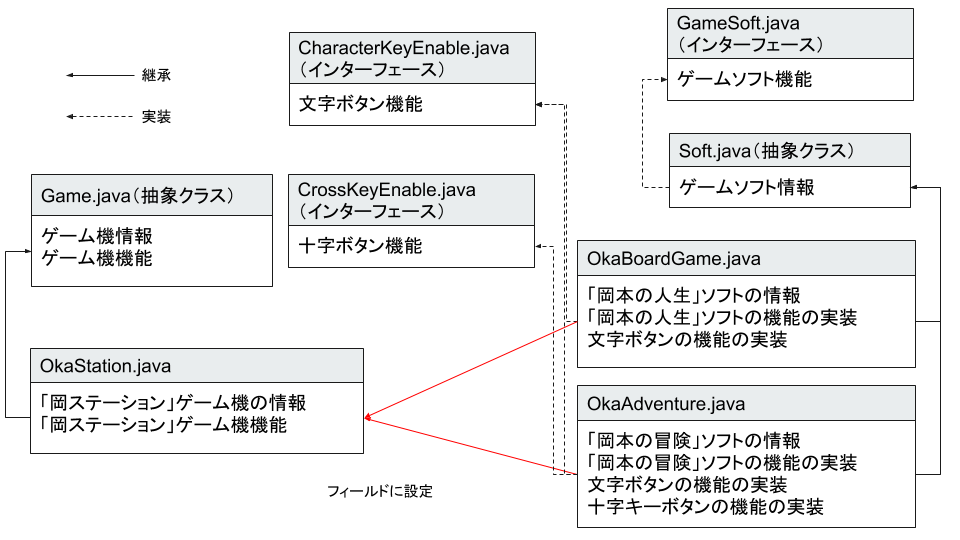

# JavaOOP 総合問題

## 追加問題

ゲーム機とゲームソフトをオブジェクト指向で表現します。



### 問題１

ゲームソフトの標準的な機能を定義する`ゲームソフトインターフェース(GameSoft.java)'を作成します。

A ボタンと B ボタンを押した際の機能を定義した`文字ボタンインターフェース(CharacterKeyEnable.java)`を作成します。

十字キーを押した際の機能を定義した`十字キーインターフェース(CrossKeyEnable.java)`を作成します。 今回キーボードの十字キーを使用するのではなく、`k キー`を`↑ キー`に、`j キー`を`↓ キー`に、`l キー`を`→ キー`に、`h キー`を`← キー`として使用します。

#### ゲームソフトインターフェース(GameSoft.java)

- メソッド

  | メソッド名 | 引数   | 戻り値 | 説明                                   |
  | --- | --- | --- | --- |
  | getGameName   | なし   | 文字列   | ゲームソフト名を返却する。         |
  | loadSoft   | なし   | なし   | ゲームソフトの情報を表示する。         |
  | gameStart  | なし   | なし   | ゲーム開始時の初期機能を実装する。     |
  | pushButton | 文字列 | なし   | 押されたボタンに応じた処理を実行する。 |

#### 文字ボタンインターフェース(CharacterKeyEnable.java)

- メソッド

  | メソッド名 | 引数 | 戻り値 | 説明                                   |
  | --- | --- | --- | --- |
  | pushA      | なし | 整数   | A ボタンが押された時の処理を実装する。 |
  | pushB      | なし | 整数   | B ボタンが押された時の処理を実装する。 |

#### 十字キーインターフェース(CrossKeyEnable.java)

- メソッド

  | メソッド名 | 引数 | 戻り値 | 説明                                 |
  | --- | --- | --- | --- |
  | pushK      | なし | なし   | k キーが押された時の処理を実装する。 |
  | pushJ      | なし | なし   | j キーが押された時の処理を実装する。 |
  | pushL      | なし | なし   | l キーが押された時の処理を実装する。 |
  | pushH      | なし | なし   | h キーが押された時の処理を実装する。 |

### 問題２

抽象クラスである`ゲームクラス(Game.java)`と`ゲームソフトクラス(Soft.java)`を作成します。
`ゲームソフトクラス(Soft.java)`は、`ゲームソフトインターフェース(GameSoft.java)`を実装します。
前回作成したクラスを流用します。

#### ゲーム機クラス(Game.java)

抽象クラスです。

- フィールド名

  | フィールド名 | 型          | 説明                             |
  | --- | --- | --- |
  | name         | 文字列      | ゲーム機名                       |
  | soft         | GameSoftインターフェース | 接続ゲームソフト                 |
  | power        | 真偽値      | 電源(`True`：電源入,`False`：電源切) |

- コンストラクタ

  | 引数       | 説明                                                                       |
  | --- | --- |
  | ゲーム機名 | フィールドのゲーム機名に引数の値を設定する。さらに電源を切った状態にする。 |

- メソッド

  | メソッド名  | 引数        | 戻り値 | 説明     |
  | --- | --- | --- | --- |
  | powerButton | なし        | なし   | ゲーム機の電源ボタン。電源がついている場合は電源を切る。電源が切れている場合は電源をつける。                                                                         |
  | setSoft     | GameSoftインターフェース | なし   | ・ゲームソフトをセットする。フィールドの soft に、引数の値を設定する。<br>・ゲーム機の電源がついている状態であれば、ゲームソフトの情報を表示するメソッドを呼び出す。 |
  | showStatus  | なし        | なし   | 抽象メソッド。ゲーム機の情報を表示する。                                                                                                                             |
  | gameStart   | なし        | なし   | 抽象メソッド。セットされているゲームソフトを実行する。                                                                                                               |

#### ゲームソフトクラス(Soft.java)

抽象クラスです。`ゲームソフトインターフェース(GameSoft.java)`を実装します。

- フィールド

  | フィールド名 | 型     | 説明             |
  | --- | --- | --- |
  | name         | 文字列 | ゲームソフト名   |
  | size         | 整数   | ゲームソフト容量 |

### 問題３

ゲーム機の実体である`岡ステーション(OkaStation.java)`を作成します。`岡ステーション(OkaStation.java)`は`ゲームクラス(Game.java)`を継承します。

ゲームソフトの実体である`岡本の人生(OkaBoardGame.java)`を作成します。`岡本の人生(OkaBoardGame.java)`は`ゲームソフトクラス(Soft.java)`を継承し、`文字ボタンインターフェース(CharacterKeyEnable.java)`を実装します。

#### 岡ステーション(OkaStation.java)

`ゲームクラス(Game.java)`を継承する。

- フィールド

  | フィールド名 | 型   | 説明                 |
  | --- | --- | --- |
  | version      | 整数 | ゲーム機のバージョン |

- コンストラクタ

  | 引数                             | 説明                                                                                                                   |
  | --- | --- |
  | ゲーム機名、ゲーム機のバージョン | ・継承元のコンストラクタを呼び出し、ゲーム機名を設定する。<br>・フィールドのゲーム機のバージョンに引数の値を設定する。 |

- メソッド

  | メソッド名 | 引数 | 戻り値 | 説明                                                                                                                                                                                                                          |
  | --- | --- | --- | --- |
  | showStatus | なし | なし   | ・`*----ゲーム機情報----*`<br> `ゲーム機名：岡ステーション"バージョン"`<br>`バージョン： "バージョン"`<br> `ソフト名："ソフト名"`<br> を表示する<br> ・電源がついていない場合は、「電源がついていません。」と表示されること。 |
  | gameStart  | なし | なし   | ・セットされているゲームソフトの`gameStartメソッド`を呼び出す。<br>・キーボード入力を読み取り、`q`キーが押された場合はゲームを終了し、それ以外のキーが押された場合はゲームソフトの`pushButtonメソッド`を呼び出す。            |

#### 岡本の人生(OkaBoardGame.java)

`ゲームソフトクラス(Soft.java)`を継承し、`文字ボタンインターフェース(CharacterKeyEnable.java)`を実装します。

- フィールド

  | フィールド名 | 型     | 説明                             |
  | --- | --- | --- |
  | name         | 文字列 | ゲームソフト名(定数：岡本の人生) |
  | size         | 整数   | ゲームソフト容量(定数：10)       |
  | stage        | 文字列 | ゲームステージ                   |
  | playNumber   | 整数   | プレイヤー人数                   |

- メソッド

  | メソッド名 | 引数   | 戻り値 | 説明                                                                                                                                                                                                                                                   |
  | --- | --- | --- | --- |
  | getGameName   | なし   | 文字列  | フィールドのnameを戻り値として返却する |
  | loadSoft   | なし   | なし   | `*----ゲームソフトを読み込みました。----*` <br> `ゲームソフト名：岡本の人生` <br>`ソフト容量：10 GB` <br>を表示する                                                                                                                                    |
  | gameStart  | なし   | なし   | ・`[岡本の人生]`<br> `岡本の人生へようこそ。`<br> `ゲームを始める前に、ステージとプレイヤーの人数を設定してください。`<br> を表示する<br>・標準入力を取得し、フィールドのステージ名とプレーヤー人数に値を代入する。                                    |
  | pushButton | 文字列 | なし   | ・`a`キーが押された場合は、`pushAメソッド`を呼び出し値を取得する。取得した値を用いて画面に`??万円手に入れた。`と出力する。<br>・`b`キーが押された場合は、`pushBメソッド`を呼び出し値を取得する。取得した値を用いて画面に`??万円手失った。`と出力する。 |
  | pushA      | なし   | 整数   | 0〜10 までのランダムな整数を戻り値として返す。                                                                                                                                                                                                         |
  | pushB      | なし   | 整数   | 0〜50 までのランダムな整数を戻り値として返す。                                                                                                                                                                                                         |

### 問題４

ゲームソフトの実体である`岡本の冒険(OkaAdventure.java)`を作成します。`岡本の冒険(OkaAdventure.java)`は`ゲームソフトクラス(Soft.java)`を継承し、`文字ボタンインターフェース(CharacterKeyEnable.java)`と`十字キーインターフェース(CrossKeyEnable.java)`を実装します。


#### 岡本の冒険(OkaAdventure.java)

- フィールド

  | フィールド名  | 型     | 説明                             |
  | --- | --- | --- |
  | name          | 文字列 | ゲームソフト名(定数：岡本の冒険) |
  | size          | 整数   | ゲームソフト容量(定数：4)        |
  | characterName | 文字列 | キャラクター名                   |

- メソッド

  | メソッド名 | 引数   | 戻り値 | 説明                                                                                                                                                                                                                                                                                                                                                                                                                                                                                                                                                         |
  | --- | --- | --- | --- |
  | getGameName   | なし   | 文字列  | フィールドのnameを戻り値として返却する |
  | loadSoft   | なし   | なし   | `*----ゲームソフトを読み込みました。----*` <br> `ゲームソフト名：岡本の冒険` <br>`ソフト容量：4 GB` <br>を表示する                                                                                                                                                                                                                                                                                                                                                                                                                                           |
  | gameStart  | なし   | なし   | ・`[岡本の冒険]`<br> `岡本の冒険へようこそ。`<br> `ゲームを始める前に、冒険者の名前を設定してください。`<br> を表示する<br>・標準入力を取得し、フィールドのキャラクター名に値を代入する。                                                                                                                                                                                                                                                                                                                                                                    |
  | pushButton | 文字列 | なし   | ・`kキー`が押された場合は、`pushKメソッド`を呼び出す。<br>・`jキー`が押された場合は、`pushJメソッド`を呼び出す。<br>・`lキー`が押された場合は、`pushLメソッド`を呼び出す。<br>・`hキー`が押された場合は、`pushHメソッド`を呼び出す。<br>・`a`キーが押された場合は、`pushAメソッド`を呼び出し値を取得する。取得した値を用いて画面に`冒険者"キャラクター名"は攻撃力(??)で攻撃します。`と出力する。<br>・`b`キーが押された場合は、`pushBメソッド`を呼び出し値を取得する。取得した値を用いて画面に`冒険者"キャラクター名"は守備力(??)で防御します。`と出力する。 |
  | pushA      | なし   | 整数   | 0〜100 までのランダムな整数を戻り値として返す。                                                                                                                                                                                                                                                                                                                                                                                                                                                                                                              |
  | pushB      | なし   | 整数   | 0〜100 までのランダムな整数を戻り値として返す。                                                                                                                                                                                                                                                                                                                                                                                                                                                                                                              |
  | pushK      | なし   | なし   | `ジャンプします。`を画面に出力する。                                                                                                                                                                                                                                                                                                                                                                                                                                                                                                                         |
  | pushJ      | なし   | なし   | `しゃがみます。`を画面に出力する。                                                                                                                                                                                                                                                                                                                                                                                                                                                                                                                           |
  | pushL      | なし   | なし   | `右に移動します。`を画面に出力する。                                                                                                                                                                                                                                                                                                                                                                                                                                                                                                                         |
  | pushH      | なし   | なし   | `左に移動します。`を画面に出力する。                                                                                                                                                                                                                                                                                                                                                                                                                                                                                                                         |

### 動作確認

以下の実行結果となるように、動作確認クラス`Main.java`を作成します。

### 動作確認

- 動作確認クラス

  ```java
  public class Main {
      public static void main(String[] args) {

          Game okaStation = new OkaStation("岡ステーション", 4);
          okaStation.powerButton();

          GameSoft okaAdventure = new OkaAdventure();
          okaStation.setSoft(okaAdventure);
          okaStation.gameStart();

          GameSoft okaBoardgame = new OkaBoardGame();
          okaStation.setSoft(okaBoardgame);
          okaStation.gameStart();

          okaStation.powerButton();
      }
  }
  ```

- 動作確認

  ```bash
  ようこそ岡ステーションへ。

  *----ゲームソフトを読み込みました。----*
  ゲームソフト名：岡本の冒険
  ソフト容量：4 GB

  [岡本の冒険]
  ゲームを始める前に冒険者の名前を設定してください。
  冒険者の名前 > 岡本    ⬅️入力
  冒険者*岡本*で冒険を始めます。

  > l    ⬅️入力
  右に移動します。
  > k    ⬅️入力
  ジャンプします。
  > j    ⬅️入力
  しゃがみます。
  > h    ⬅️入力
  左に移動します。
  > a    ⬅️入力
  冒険者岡本は攻撃力（41）で攻撃します。
  > b    ⬅️入力
  冒険者岡本は守備力（98）で防御します。
  > q    ⬅️入力
  ゲームを終了します。
  *----ゲームソフトを読み込みました。----*
  ゲームソフト名：岡本の人生
  ソフト容量：10 GB

  [岡本の人生]
  岡本の人生へようこそ。
  ゲームを始める前に、ステージとプレイヤーの人数を設定してください。
  ステージ名 > 砂漠    ⬅️入力

  プレイヤー人数 > 4    ⬅️入力
  ステージ名：砂漠
  プレイヤー人数：4人
  でゲームを始めます。
  > a    ⬅️入力
  2万円手に入れた。
  > b    ⬅️入力
  41万円失った。
  > a    ⬅️入力
  1万円手に入れた。
  > b    ⬅️入力
  4万円失った。
  > q    ⬅️入力
  ゲームを終了します。
  ゲーム機の電源を切ります。さようなら。
  ```
